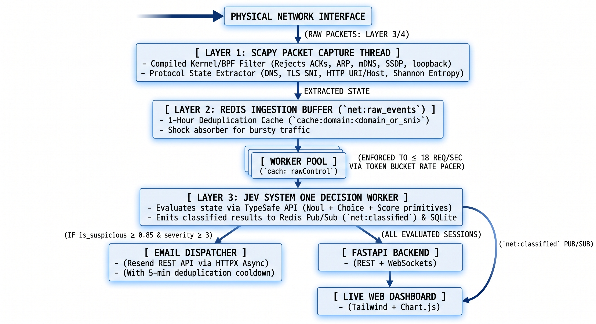

# NetworkSentinel (Jev System One Edition)

[](https://www.python.org/downloads/)
[](https://fastapi.tiangolo.com)
[](https://scapy.net)
[](https://redis.io)
[](https://typesafe.ai)
[](https://opensource.org/licenses/MIT)

**NetworkSentinel** is a lightweight, real-time network telemetry triage and threat detection system. It passively captures Layer 3/4 network traffic, filters noise in memory, buffers flows in Redis, evaluates anomalies using **TypeSafe AI's Jev** System One decision model, streams live telemetry to a cyber-styled dashboard over WebSockets, and dispatches containment alerts via **Resend**.



---

## ⚡ Core Features

* **Passive L3/L4 Capture**: Kernel BPF filtering and asynchronous packet processing powered by Scapy.
* **L1 Deterministic Pre-Filter**: Bypasses encrypted TLS application data and zero-payload TCP packets, eliminating token waste and latency on benign traffic.
* **Bidirectional Flow Caching**: Redis-backed flow pair caching delivers a **>99% cache hit ratio** for routine connections.
* **Jev System One AI Triage**: Evaluates suspicious probability (`is_suspicious`), threat category (`threat_category`), and operational risk score (`severity`).
* **Real-Time SOC Dashboard (`/`)**: Live telemetry velocity charts, threat distribution doughnut, and instant packet inspection.
* **Incident Dispatch Center (`/alerts`)**: Dedicated full-screen audit ledger with status tabs, search, and one-click Resend tracking.
* **Automated Email Alerting**: Instant incident dispatch via Resend with a 5-minute per-source cooldown to prevent notification fatigue.
* **Built-In Attack Simulator**: 1-click security drills for C2 Beacons, SQL Injection, DNS Tunneling, and Port Scanning.

---

## 🚀 Quick Start: Choose Your Environment

NetworkSentinel captures **real physical network traffic** across three environments:

### 1. Clone & Configure
```bash
git clone https://github.com/your-username/network-sentinel.git
cd "network-sentinel"
cp .env.example .env
```
Edit `.env` with your [TypeSafe Jev](https://typesafe.ai) and [Resend](https://resend.com) API keys.

---

### 2. Choose How to Run

Select the deployment option that matches your platform and monitoring goals:

### Option 1: Run Locally (macOS & Linux)
> **Required for macOS:** Docker Desktop on macOS runs inside a virtual machine and cannot capture traffic outside the container. Running locally gives NetworkSentinel direct raw socket access to your physical Wi-Fi/Ethernet interface (`en0` / `eth0` / `wlan0`). This method works identically on both macOS and Linux.

```bash
# 1. Start Redis in background (via Docker or local package manager)
docker run -d -p 6379:6379 --name redis redis:alpine

# 2. Set up Python environment
python3 -m venv venv
source venv/bin/activate
pip install -r requirements.txt

# 3. Launch NetworkSentinel (sudo required for raw socket capture)
sudo venv/bin/python3 -m uvicorn app.main:app --host 0.0.0.0 --port 8000 --reload
```
*(On macOS, you can also run `./start-mac.sh` which automates these steps).*

---

### Option 2: Run via Docker (Linux Only)
> **Linux Only:** On Linux, Docker runs directly on the native host kernel (`network_mode: host`), allowing containers to capture real traffic from physical adapters (`eth0`, `wlan0`) outside the container. *(This does NOT work on macOS due to Docker VM isolation).*

```bash
docker compose -f docker-compose.linux.yml up -d --build
```

---

### Option 3: Whole-Home Network Monitoring (All Devices: Smart TVs, Phones, IoT)
> **Monitor Everything:** Home Wi-Fi routers enforce unicast isolation between client devices. To passively inspect traffic from **every device across your household** (phones, smart TVs, IoT cameras):
* **Router DNS / Gateway Redirection**: Point your home router's Primary DNS or Gateway to NetworkSentinel (Pi-hole style).
* **Managed Switch Port Mirroring (SPAN)**: Duplicate 100% of router traffic to NetworkSentinel with zero added latency.
* **Inline Appliance**: Run NetworkSentinel on a dual-NIC Raspberry Pi or Mini PC as a transparent hardware bridge.

👉 Follow the complete step-by-step setup in [**docs.md: Whole-Home Network Monitoring Guide**](docs.md#73-whole-home-network-monitoring-all-devices-smart-tvs-phones-iot).

---

### 3. Open the Dashboard
* **Live Telemetry Stream**: [http://localhost:8000](http://localhost:8000)
* **Incident Dispatch Center**: [http://localhost:8000/alerts](http://localhost:8000/alerts)

---

## 📖 In-Depth Documentation

For detailed guides, architecture diagrams, and complete manuals, see [**docs.md**](docs.md):

| Documentation Section | What It Covers |
|---|---|
| [**Architecture & Multi-Tier Funnel**](docs.md#1-system-architecture--multi-tier-triage-funnel) | Ingestion pipeline, Redis queue, and Jev cognitive triage workflow. |
| [**Dashboard Operator Guide**](docs.md#2-dashboard-operator-guide-) | Live KPI cards, Chart.js metrics, and the 3-tab Forensic Inspector modal. |
| [**Incident Dispatch Center (`/alerts`)**](docs.md#3-incident-dispatch-center-alerts) | Full-screen alerts ledger, status filters, search, and Resend auditing. |
| [**L1 Pre-Filter & Caching Engine**](docs.md#4-l1-deterministic-pre-filter--bidirectional-flow-caching) | TLS data bypass, zero-payload pruning, and bidirectional flow keys. |
| [**Email Alerting & Resend Setup**](docs.md#5-email-alerting--resend-dispatch-engine) | Sandbox setup, custom domain verification, and 5-min cooldown logic. |
| [**REST & WebSocket API Reference**](docs.md#6-rest--websocket-api-reference) | Full reference for all HTTP endpoints and WebSocket feeds. |
| [**Deployment Architectures (Local, Linux Docker, Whole-Network)**](docs.md#7-real-world-traffic-capture--deployment-architectures) | Running locally on Mac/Linux, host-mode Docker on Linux, and whole-home monitoring. |
| [**Troubleshooting & FAQs**](docs.md#8-advanced-troubleshooting--faqs) | Common network interface, permission, and Resend delivery questions. |

---

## 🧪 Security Drills & CLI Testing

Run simulated cyber incidents to test detection and alerting without sending real attacks:

```bash
# Inject a C2 Beaconing scenario
python3 simulate.py --scenario c2_beacon --count 5

# Inject a DNS Tunneling exfiltration scenario
python3 simulate.py --scenario dns_tunneling --http http://localhost:8000

# Run automated test suite
pytest -v
```

---

## 📄 License

This project is licensed under the MIT License - see the [LICENSE](LICENSE) file for details.
