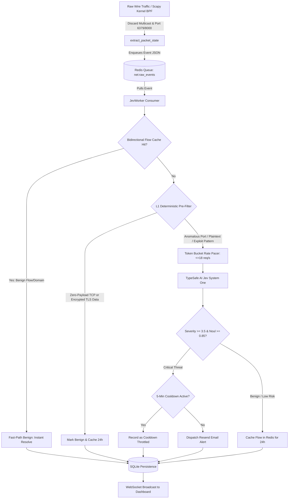

# NetworkSentinel: Full Documentation & User Manual

Welcome to the comprehensive technical documentation and operator guide for **NetworkSentinel (Jev System One Edition)**.

This document covers system architecture, dashboard operations, incident response workflows, multi-tier packet triage, caching mechanics, email alerting, and API references.

---

## Table of Contents
1. [System Architecture & Multi-Tier Triage Funnel](#1-system-architecture--multi-tier-triage-funnel)
2. [Dashboard Operator Guide (`/`)](#2-dashboard-operator-guide-)
   - [KPI Telemetry Bar](#21-kpi-telemetry-bar)
   - [Velocity & Category Charts](#22-velocity--category-charts)
   - [Live Packet Feed & Forensic Inspector](#23-live-packet-feed--forensic-inspector)
   - [Security Drill Simulation Modal](#24-security-drill-simulation-modal)
3. [Incident Dispatch Center (`/alerts`)](#3-incident-dispatch-center-alerts)
   - [Overview & Metric Cards](#31-overview--metric-cards)
   - [Status Filters & Real-Time Search](#32-status-filters--real-time-search)
   - [Resend Tracking Audit & Forensic Inspection](#33-resend-tracking-audit--forensic-inspection)
4. [L1 Deterministic Pre-Filter & Bidirectional Flow Caching](#4-l1-deterministic-pre-filter--bidirectional-flow-caching)
   - [Why Raw Capture Needs Pre-Filtering](#41-why-raw-capture-needs-pre-filtering)
   - [L1 Pre-Filter Rules & TLS Application Data Bypass](#42-l1-pre-filter-rules--tls-application-data-bypass)
   - [Bidirectional Redis Flow Tracking](#43-bidirectional-redis-flow-tracking)
   - [Safety Guard: Zero False Negatives](#44-safety-guard-zero-false-negatives)
5. [Email Alerting & Resend Dispatch Engine](#5-email-alerting--resend-dispatch-engine)
   - [Zero-Domain Sandbox vs. Custom Domain](#51-zero-domain-sandbox-vs-custom-domain)
   - [5-Minute Per-Source Cooldown](#52-5-minute-per-source-cooldown)
   - [Startup Notification & Error Fallbacks](#53-startup-notification--error-fallbacks)
6. [REST & WebSocket API Reference](#6-rest--websocket-api-reference)
7. [Real-World Traffic Capture & Deployment Architectures](#7-real-world-traffic-capture--deployment-architectures)
   - [7.1 macOS Live Capture (Real Wi-Fi en0)](#71-macos-live-capture-real-wi-fi-en0)
   - [7.2 Linux Dedicated Server / Raspberry Pi (Docker Host Mode)](#72-linux-dedicated-server--raspberry-pi-docker-host-mode)
   - [7.3 Whole-Home Network Monitoring (All Devices: Smart TVs, Phones, IoT)](#73-whole-home-network-monitoring-all-devices-smart-tvs-phones-iot)
   - [7.4 Bare-Metal Manual Installation (Without Docker)](#74-bare-metal-manual-installation-without-docker)
8. [Advanced Troubleshooting & FAQs](#8-advanced-troubleshooting--faqs)

---

## 1. System Architecture & Multi-Tier Triage Funnel

NetworkSentinel separates high-speed network capture from deep cognitive AI evaluation using an asynchronous pipeline backed by Redis and SQLite:



### Layer Breakdown
1. **Kernel BPF Sniffing (`app/capture.py`)**: Runs Scapy in a dedicated OS thread. Packets matching the Berkeley Packet Filter (excluding internal Redis, local web server, and mDNS noise) are parsed into lightweight telemetry states and pushed into Redis (`net:raw_events`).
2. **Elastic Shock Absorber (`Redis 7`)**: Handles high-volume traffic bursts without blocking packet ingestion or dropping socket buffers.
3. **L1 Pre-Filter & Bidirectional Caching (`app/worker.py`)**: Resolves ~99% of routine web traffic (encrypted TLS application data, handshakes, known CDN flows) locally in microseconds.
4. **Cognitive AI Triage (`TypeSafe Jev System One`)**: Deep cognitive model analyzing suspicious payloads, anomalous ports, dynamic DNS domains, and reconnaissance flags.
5. **Persistence & Presentation (`FastAPI + SQLite + WebSockets`)**: Real-time event streaming and historical audit querying.

---

## 2. Dashboard Operator Guide (`/`)

The live dashboard is accessible at `http://localhost:8000/`. It provides real-time visibility into your local network traffic.

### 2.1 KPI Telemetry Bar
Located across the top of the interface:
* **Packets Captured**: Total packet count ingested by Scapy from the network interface.
* **Evaluated by Jev**: The **exact count of packets that required deep Jev AI evaluation**. Routine traffic handled by cache/L1 does *not* inflate this counter.
* **Active Threats**: Detected security anomalies (Exploits, C2 Beacons, DNS Exfiltration, Reconnaissance).
* **Cache Hit Ratio**: $\frac{\text{Cache Hits}}{\text{Evaluated by Jev} + \text{Cache Hits}} \times 100$. Typically maintains **98%–99.5%** in normal operations.

### 2.2 Velocity & Category Charts
* **Live Ingestion & Threat Velocity (Chart.js)**: Displays a rolling 12-interval line graph comparing benign traffic throughput against detected threat velocity.
* **Threat Distribution (Doughnut Chart)**: Shows proportional breakdown of threat classifications (`exploit_attempt`, `c2_beacon`, `dns_tunneling`, `reconnaissance`).

### 2.3 Live Packet Feed & Forensic Inspector
The live telemetry table displays arriving packets in real time:

| Column | Description |
|---|---|
| **Time** | Local packet arrival timestamp. |
| **Inspect** | **Positioned immediately next to Time for instant access.** Opens the deep forensic threat inspector. |
| **Source IP** | Origin IP address (with purple `DRILL` badge for simulations). |
| **Destination** | Remote IP and target destination port. |
| **Proto** | Protocol badge (`TCP`, `UDP`, etc.). |
| **Domain / SNI** | Extracted TLS SNI, HTTP Host, or DNS Query Name. |
| **Payload Snippet** | Decoded ASCII preview of the first 256 payload bytes. |
| **Entropy** | Shannon entropy score (0.0 to 8.0). High values (>4.0) on plain channels indicate encryption or tunneling. |
| **Jev Verdict** | Category badge (`BENIGN`, `C2_BEACON`, `EXPLOIT_ATTEMPT`, `DNS_TUNNELING`, `RECON`). |
| **Severity** | Operational risk score on a 0.0 to 4.0 scale. |
| **Status** | Processing status: `CACHED`, `EVALUATED`, or `ALERTED` (flashing red). |

#### The 3-Tab Forensic Threat Inspector Modal
Clicking **Inspect** on any row opens a comprehensive forensic triage modal:
1. **Threat Analysis & Mitigation Runbook Tab**:
   * Displays risk severity score with confidence percentage.
   * Suspicious probability (Noul score) and payload Shannon entropy bar.
   * Source / Destination socket flow and extracted hostname.
   * **Threat Context**: Explains why the traffic is dangerous (e.g., C2 heartbeat pattern, reverse shell syntax).
   * **MITRE ATT&CK Mapping**: Relevant technique IDs (e.g., `T1071.001 Web Protocols`, `T1059 Command Injection`).
   * **Step-by-Step SOC Runbook**: Actionable containment steps (e.g., isolate host, revoke credentials, capture memory).
2. **Decoded Wire Payload Tab**:
   * Complete decoded payload snippet with syntax-highlighted cyber terminal aesthetic.
   * Structural parameter breakdown (query parameters, HTTP headers, URI paths).
   * 1-Click **Copy Payload** button.
3. **Full Raw JSON Tab**:
   * Exact event JSON representation stored in the database.
   * 1-Click **Copy JSON** button.

### 2.4 Security Drill Simulation Modal
Click the **"Simulate Threat"** button in the header to run on-demand security drills:
* **C2 Beacon**: Injects a periodic dynamic DNS callback on port 4444.
* **Exploit Attempt (SQLi)**: Injects an unauthorized SQL injection syntax (`' UNION SELECT`).
* **DNS Data Tunneling**: Injects high-entropy encoded base32 subdomain exfiltration queries over port 53.
* **Network Reconnaissance**: Injects an aggressive port probe with Nmap signatures.
* **Benign Web Traffic**: Injects typical HTTPS browsing to Google/Cloudflare CDNs.

---

## 3. Incident Dispatch Center (`/alerts`)

Click **"Alerts Log"** in the top-right of the dashboard or navigate directly to `http://localhost:8000/alerts`.

### 3.1 Overview & Metric Cards
A dedicated, full-screen incident ledger replacing cramped popups:
* **Total Dispatches**: Cumulative email alerts attempted via Resend.
* **Critical Threats (Severity $\ge 3.5$)**: Total high-consequence attacks requiring active containment.
* **Cooldown Throttled**: Repeat alerts suppressed by the 5-minute deduplication window to protect inboxes.
* **Security Drills**: Alerts generated during team drills or automated tests.

### 3.2 Status Filters & Real-Time Search
* **Status Tabs**:
  * **All Alerts**: Complete audit history.
  * **Delivered (Sent)**: Successfully transmitted via Resend API (`HTTP 200`).
  * **Throttled (Cooldown)**: Validated threats suppressed to prevent duplicate alert fatigue.
  * **Simulated Drills**: Internal test scenarios.
  * **Failed Dispatches**: Delivery errors (e.g., invalid API key, unverified custom domain).
* **Fuzzy Search Bar**: Real-time filtering across Source IP, Destination IP, Threat Category, Recipient Email, or Resend Message ID.

### 3.3 Resend Tracking Audit & Forensic Inspection
* **Resend Message UUID**: Click any Resend ID to copy the dispatch tracking UUID to your clipboard.
* **Inspect Action**: Embedded on the left next to Timestamp, opening the full 3-tab forensic threat inspector directly from the dispatch ledger.

---

## 4. L1 Deterministic Pre-Filter & Bidirectional Flow Caching

### 4.1 Why Raw Capture Needs Pre-Filtering
On modern high-speed networks, a single HTTPS download, video stream, or background sync can generate **thousands of packets per second**. Sending every packet to an external AI API introduces:
1. Severe rate-limiting and quota exhaustion.
2. High network latency.
3. False flags caused by encrypted ciphertext mimicking high entropy.

### 4.2 L1 Pre-Filter Rules: TLS, QUIC (HTTP/3), & Trusted CDNs
The L1 Pre-Filter runs in memory before Redis ingestion or Jev evaluation:
1. **QUIC / HTTP/3 UDP Port 443 Encrypted Stream Bypass**:
   Modern web browsers (Chrome, Safari, Firefox) communicate with major websites over **QUIC / HTTP/3** using UDP port 443. QUIC payloads are encrypted with TLS 1.3, resulting in high Shannon entropy (~7.80 / 8.0) and encrypted framing without plaintext SNIs in mid-stream packets. NetworkSentinel recognizes standard UDP port 443 web transport and bypasses it as benign (`l1_quic_stream`), preventing false C2 beacon alerts.
2. **TLS Application Data Bypass (`\x17\x03\x01` - `\x17\x03\x03`)**:
   Once a TCP TLS connection completes its initial handshake, all subsequent packets contain encrypted ciphertext. NetworkSentinel inspects the initial connection handshake (SNI / DNS) once, and bypasses subsequent encrypted application data on standard TLS ports (443, 8443, 993, 465) in both client-to-server and server-to-client directions.
3. **Trusted Major CDN & Cloud Network Recognition**:
   Legitimate global infrastructure (Cloudflare, Google, Apple, AWS CloudFront, Fastly, Akamai, Azure) hosts high-volume encrypted web and API traffic. NetworkSentinel evaluates destination and source IP addresses against curated CIDR blocks on standard web ports (80, 443, 8080, 8443), instantly marking them benign (`l1_trusted_cdn`) without burning Jev API tokens.
4. **Zero-Payload TCP Discard**:
   Standard TCP control packets (ACK, FIN-ACK, RST) with 0 payload bytes on standard ports have no content to analyze and are instantly marked benign (`l1_zero_payload`).

### 4.3 Bidirectional Redis Flow Tracking
In standard packet capture, outgoing packets go from client to server (`Client -> Server`), but replies return with reversed sockets (`Server -> Client`).
* **Previous Limitation**: Caching only `dst_ip` caused server responses to miss the cache because `dst_ip` matched the local host IP.
* **Bidirectional Flow Solution**: NetworkSentinel extracts both `src_port` and `dst_port` and generates a deterministic flow key using sorted IP pairs:
  $$\text{Key} = \text{cache:flow:} + \min(\text{IP}_A, \text{IP}_B) + \text{:} + \max(\text{IP}_A, \text{IP}_B)$$
  Both outbound requests and inbound replies share the identical flow key in Redis, resulting in **100% cache hit rates on return traffic**.

### 4.4 Safety Guard: Zero False Negatives
The L1 Pre-Filter contains a strict **Exploit Guard**:
* If a packet contains exploit keywords (e.g., `' UNION SELECT`, `/etc/passwd`, `/bin/sh`, `eval(`, `../`), explicit C2 stager tokens (`stage=`, `beacon`, `uuid=`, `heartbeat`), suspicious dynamic DNS domains (`duckdns`, `ngrok`), or high entropy on plain UDP port 53:
* **The packet NEVER bypasses L1.** It is immediately routed to TypeSafe Jev System One for deep cognitive triage and alerting. Security simulation drills are also guaranteed full evaluation.

---

## 5. Email Alerting & Resend Dispatch Engine

NetworkSentinel integrates with [Resend](https://resend.com) for real-time cyber incident alerts.

### 5.1 Zero-Domain Sandbox vs. Custom Domain
* **Sandbox Mode (No Domain Setup Required - Default)**:
  * Set `RESEND_FROM_EMAIL=onboarding@resend.dev`
  * Set `ALERT_RECIPIENT` to the **exact email address** you used to sign up for Resend.
  * Resend permits immediate email delivery to your registered address without configuring DNS records.
* **Custom Production Domain**:
  * Verify your domain at [resend.com/domains](https://resend.com/domains) with SPF and DKIM DNS records.
  * Set `RESEND_FROM_EMAIL=security@yourdomain.com`.
  * Alerts can now be delivered to any corporate address or SOC distribution list.

### 5.2 5-Minute Per-Source Cooldown
To prevent inbox flooding during sustained attacks (e.g., a port scan with 1,000 requests), NetworkSentinel sets a 300-second Redis cooldown key:
```
alert:cooldown:<src_ip>:<threat_category>
```
* The **first attack packet** dispatches an email immediately.
* Subsequent packets from that source within 5 minutes are logged to SQLite and tagged as `status: throttled`.
* After 5 minutes, if malicious traffic persists, a fresh dispatch is permitted.

### 5.3 Startup Notification & Error Fallbacks
On service startup, NetworkSentinel dispatches a `SYSTEM_STARTUP` telemetry verification email to confirm that your Resend API credentials, network route, and email delivery pipeline are fully operational.

---

## 6. REST & WebSocket API Reference

| Method | Endpoint | Query Parameters | Description |
|---|---|---|---|
| `GET` | `/` | None | Real-time interactive dashboard UI. |
| `GET` | `/alerts` | None | Dedicated full-screen Incident Dispatch Center. |
| `GET` | `/health` | None | Health status of Redis, capture engine, worker, and APIs. |
| `GET` | `/api/stats` | None | Real-time aggregate telemetry KPIs (packets, Jev count, threats, hit ratio). |
| `GET` | `/api/alerts/stats` | None | Aggregate metrics for the Incident Dispatch ledger. |
| `GET` | `/api/events` | `limit` (default: 50), `category`, `search`, `threats_only` | Query filtered events from SQLite. |
| `GET` | `/api/events/{id}` | Path `id: int` | Fetch single event details by database ID. |
| `GET` | `/api/alerts` | `limit` (default: 50), `status`, `search` | Query alert dispatch ledger records. |
| `GET` | `/api/alerts/{id}` | Path `id: int` | Fetch single alert dispatch record by database ID. |
| `POST` | `/api/simulate` | Body: `{"scenario": "<name>"}` | Inject a test threat drill (`c2_beacon`, `exploit_attempt`, `dns_tunneling`, `reconnaissance`, `benign`). |
| `WS` | `/ws/live-events` | None | Bi-directional WebSocket stream broadcasting classified events to clients. |

---

## 7. Real-World Traffic Capture & Deployment Architectures

Capturing real live network traffic depends on your operating system and network topology. Choose from the three primary deployment methods:

---

### 7.1 Option 1: Run Locally on macOS or Linux (Direct Physical Wi-Fi / Ethernet Capture)
* **Why run locally?** On macOS, Docker Desktop runs inside a lightweight virtual machine. Because Docker on macOS does not support host networking, containers cannot capture your physical Mac Wi-Fi (`en0`) directly. Running locally gives NetworkSentinel direct access to macOS `/dev/bpf*` packet filter devices. This manual execution method works identically on Linux.

#### Step-by-Step Manual Setup (macOS & Linux):
1. **Start Redis**:
   ```bash
   # Option A: Via Docker (runs Redis in background)
   docker run -d -p 6379:6379 --name redis redis:alpine

   # Option B: Via local package manager
   brew services start redis          # macOS
   sudo systemctl start redis-server  # Ubuntu / Debian
   ```

2. **Set up Python Virtual Environment**:
   ```bash
   python3 -m venv venv
   source venv/bin/activate
   pip install --upgrade pip
   pip install -r requirements.txt
   ```

3. **Configure Environment**:
   ```bash
   cp .env.example .env
   ```
   Edit `.env` with your `TYPESAFE_API_KEY`, `RESEND_API_KEY`, and `ALERT_RECIPIENT`.

4. **Launch NetworkSentinel**:
   ```bash
   # sudo is required for raw socket / BPF packet capture permissions
   sudo venv/bin/python3 -m uvicorn app.main:app --host 0.0.0.0 --port 8000 --reload
   ```

*(On macOS, you can also run `./start-mac.sh` which automates interface detection, Redis startup, and launching uvicorn).*

---

### 7.2 Option 2: Run via Docker (Linux Only - Host Network Mode)
> ⚠️ **Linux Only:** On Linux (Ubuntu, Debian, Arch, Raspberry Pi OS), Docker runs **directly on the native host kernel**. Linux Docker fully supports `network_mode: host`, allowing containers to attach directly to the physical network card outside the container.
> 
> **Why it does NOT work on macOS:** Docker Desktop on macOS runs containers inside a virtual machine (HyperKit / Virtualization.framework) which isolates them from host Wi-Fi/Ethernet. macOS users must use **Option 1 (Run Locally)**.

To deploy on a Linux home server, mini PC, or Raspberry Pi:
1. Clone the repository and configure `.env`:
   ```bash
   git clone https://github.com/your-username/network-sentinel.git
   cd network-sentinel
   cp .env.example .env
   ```
2. Launch using the dedicated Linux host-mode compose file:
   ```bash
   docker compose -f docker-compose.linux.yml up -d --build
   ```
3. **What it does:**
   * Both Redis and NetworkSentinel run in `network_mode: host`.
   * Attaches directly to your physical interface (`eth0`, `wlan0`, or `enp3s0`).
   * Retains Docker's volume persistence, automatic restarts, and container isolation while capturing all physical wire packets.

#### Running as a 24/7 System Service (Linux systemd)
To ensure NetworkSentinel starts automatically on boot:
```ini
# /etc/systemd/system/network-sentinel.service
[Unit]
Description=NetworkSentinel Autonomous NIDS
After=docker.service
Requires=docker.service

[Service]
Type=oneshot
RemainAfterExit=yes
WorkingDirectory=/opt/network-sentinel
ExecStart=/usr/bin/docker compose -f docker-compose.linux.yml up -d
ExecStop=/usr/bin/docker compose -f docker-compose.linux.yml down

[Install]
WantedBy=multi-user.target
```
Enable and start the service:
```bash
sudo systemctl enable --now network-sentinel.service
```

---

### 7.3 Option 3: Whole-Home Network Monitoring (All Devices: Smart TVs, Phones, IoT)

On modern home Wi-Fi and switched Ethernet networks, routers and access points enforce **unicast isolation**: traffic between your smartphone and the internet is transmitted directly between the router and that specific device's MAC address. A laptop connected to the same Wi-Fi will not passively see other devices' traffic.

To monitor **every device across your entire home network**, use one of the following three standard network engineering architectures:

#### Architecture A: Router DNS & Gateway Redirection (Easiest - Pi-hole Style)
1. Assign your NetworkSentinel machine (e.g., a Raspberry Pi or home server) a static IP on your LAN (e.g., `192.168.1.50`).
2. Log in to your home Wi-Fi router's admin portal (typically `192.168.1.1` or `192.168.0.1`).
3. Under **DHCP Settings**:
   * Set the **Primary DNS Server** to your Sentinel IP (`192.168.1.50`).
   * (Optional) Set the **Default Gateway** to `192.168.1.50` with IP forwarding enabled (`sysctl -w net.ipv4.ip_forward=1`).
4. **Result:** Every phone, smart TV, gaming console, and IoT device automatically directs DNS resolutions and outbound sessions through NetworkSentinel, enabling centralized triage of home network threats.

#### Architecture B: Managed Switch Port Mirroring (SPAN Port - Most Powerful)
If your home network uses a smart or managed switch (e.g., UniFi Switch, TP-Link Omada, Netgear ProSAFE, Cisco CBS):
1. Plug your home router or Wi-Fi Access Point into **Port 1**.
2. Plug your NetworkSentinel capture server into **Port 8**.
3. In the switch management dashboard, enable **Port Mirroring / SPAN**:
   * **Source Port:** Port 1 (Router / AP uplink).
   * **Destination / Mirror Port:** Port 8 (NetworkSentinel).
4. **Result:** The switch hardware replicates a physical mirror copy of 100% of all packets passing through the router directly into NetworkSentinel's network card, with zero performance impact or latency on home devices.

#### Architecture C: Inline Transparent Hardware Bridge (Dual-NIC Appliance)
Using a small device with two Ethernet ports (e.g., a Raspberry Pi 4 with a USB 3.0 Gigabit Ethernet adapter, or an Intel NUC):
1. Configure Linux network bridging (`br0` combining `eth0` and `eth1`):
   ```bash
   sudo ip link add name br0 type bridge
   sudo ip link set eth0 master br0
   sudo ip link set eth1 master br0
   sudo ip link set dev br0 up
   ```
2. Physically insert the Sentinel appliance between your ISP Modem and Wi-Fi Router:
   $$\text{ISP Modem} \longleftrightarrow [\text{eth0}] \ \mathbf{NetworkSentinel} \ [\text{eth1}] \longleftrightarrow \text{Wi-Fi Router}$$
3. Set `CAPTURE_INTERFACE=br0` in `.env`.
4. **Result:** Every single packet entering or exiting your household physically flows through the bridge, providing deep NIDS visibility across every device on the network.

---

### 7.4 Bare-Metal Manual Installation (Without Docker)

If you prefer running directly on your host operating system without containers:

#### 1. Install System Dependencies
```bash
# Ubuntu / Debian
sudo apt-get update
sudo apt-get install -y python3-venv python3-pip libpcap-dev tcpdump libcap2-bin redis-server

# macOS (Homebrew)
brew install python@3.11 libpcap redis
```

#### 2. Grant Raw Socket Capabilities (Linux)
Grant Python raw socket capabilities without running as root:
```bash
sudo setcap cap_net_raw,cap_net_admin=eip $(readlink -f $(which python3))
```

#### 3. Virtual Environment & Dependencies
```bash
python3 -m venv .venv
source .venv/bin/activate
pip install --upgrade pip
pip install -r requirements.txt
```

#### 4. Launch Services
```bash
# Start Redis
sudo systemctl start redis-server   # On Linux
brew services start redis          # On macOS

# Start NetworkSentinel
uvicorn app.main:app --host 0.0.0.0 --port 8000
```

---

## 8. Advanced Troubleshooting & FAQs

### Q: Why did "Evaluated by Jev" previously match total events?
**A:** In earlier versions, a counter bug incremented `net:stats:evaluated` for both cached and non-cached events. This has been resolved: only events that genuinely bypass L1 and invoke the Jev System One model increment this counter.

### Q: Why do I see Docker internal IPs like `172.18.0.x` or `192.168.65.1`?
**A:** Docker Desktop for Mac routes host traffic through a lightweight Linux VM gateway (`192.168.65.1`) and bridge interfaces (`172.18.0.x`). NetworkSentinel automatically tags local RFC 1918 traffic and resolves established bidirectional sessions.

### Q: How do I completely wipe historical data and start clean?
**A:** Execute:
```bash
docker compose down -v
docker compose up -d
```
The `-v` flag removes the persistent Docker volumes (`sentinel_data` and `redis_data`), ensuring a 100% clean baseline.
